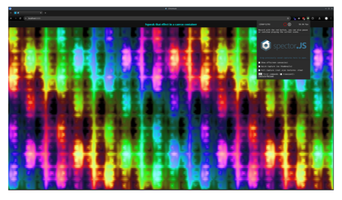

## beamterm - A WebGL2 Terminal Renderer

[![Crate Badge]][Crate] [![NPM Badge]][NPM] [![API Badge]][API] [![Deps.rs
Badge]][Deps.rs] 

A high-performance terminal rendering system for web browsers, targeting sub-millisecond render 
times. **beamterm** is a terminal renderer, not a full terminal emulator - it handles the display
layer while you provide the terminal logic.

### [Live Demos][demos]

Check out [**interactive examples**][demos] showcasing both pure Rust applications and JavaScript/TypeScript 
integrations.

## Key Features

- **Single Draw Call** - Renders entire terminal (e.g., 200×80 cells) in one instanced draw
- **Flexible Font Atlases** - Static pre-generated atlases or dynamic on-demand rasterization with LRU caching
- **Unicode and Emoji Support** - Complete Unicode support with grapheme clustering
- **Selection Support** - Mouse-driven text selection with clipboard integration (Block/Linear modes)
- **Optional JS/TS Bindings** - Provides a [JavaScript/TypeScript API](js/README.md) for easy integration


## Performance

beamterm targets sub-millisecond render times across a wide range of hardware:

| Metric                          | Target (Low-end) | Achieved (2019 hardware) |
|---------------------------------|------------------|--------------------------|
| Render Time†                    | <1ms @ 16k cells | <1ms @ 45k cells         |
| Draw Calls                      | 1 per frame      | 1 per frame              |
| Memory Usage                    | ~8.9MB           | ~8.9MB                   |
| Update Bandwidth (full refresh) | ~8 MB/s @ 60 FPS | ~22 MB/s @ 60 FPS        |

[](https://junkdog.github.io/beamterm/canvas_waves/?atlas_size=10)

The screenshot shows [Ratzilla's][rz] "canvas waves" demo running in a 426×106 terminal (45,156 cells),
maintaining sub-millisecond render times on 2019-era hardware (i9-9900K / RTX 2070).

† *Includes Ratatui buffer translation, GPU buffer uploads, and draw call execution.*

 [rz]: https://github.com/orhun/ratzilla


## System Architecture

The renderer consists of three crates:

**`beamterm-atlas`** - Generates GPU-optimized static font atlases from TTF/OTF files. Automatically
calculates cell dimensions, supports font styles (normal/bold/italic), and outputs packed
texture data.

**`beamterm-data`** - Provides shared data structures and efficient binary serialization. Features
versioned format with header validation and cross-platform encoding.

**`beamterm-renderer`** - The WebGL2 rendering engine. Implements instanced rendering with optimized
buffer management and state tracking for consistent sub-millisecond performance.


## Font Atlas Types

beamterm supports two font atlas strategies, each with different trade-offs:

### Static Font Atlas (Default)

Pre-generated atlas loaded from a binary `.atlas` file. Best when character sets are
known and consistent rendering is required.

**Usage:**
```rust
// Uses embedded default atlas
let terminal = Terminal::builder("#canvas").build()?;

// Or load a custom atlas
let atlas_data = FontAtlasData::from_binary(include_bytes!("hack-8pt.atlas"))?;
let terminal = Terminal::builder("#canvas")
    .font_atlas(atlas_data)
    .build()?;
```

Generate custom atlases with the `beamterm-atlas` CLI tool (see [beamterm-atlas/README.md](beamterm-atlas/README.md)).

### Dynamic Font Atlas

Rasterizes glyphs on-demand using the browser's Canvas API. Handles unpredictable content and can
use any system font without pre-generation.

**Usage:**
```rust
let terminal = Terminal::builder("#canvas")
    .dynamic_font_atlas(&["JetBrains Mono", "Fira Code"], 16.0)
    .build()?;
```

**How it works:**
- Glyphs are rasterized on first use via `OffscreenCanvas`
- ASCII characters (0x20-0x7E) are pre-loaded at startup
- Double-width characters (emoji, CJK) automatically use two consecutive texture slots
- 4096 total glyph slots (2048 single-width + 1024 double-width)


## Architecture Overview

The architecture leverages GPU instancing to reuse a single quad geometry across all terminal cells,
with per-instance data providing position, character, and color information. All rendering state is
encapsulated in a Vertex Array Object (VAO), enabling single-draw-call rendering with minimal CPU
overhead. The 2D texture array maximizes cache efficiency by packing related glyphs into vertical
strips within each layer.

### Buffer Management Strategy

The renderer employs several optimization strategies:

1. **VAO Encapsulation**: All vertex state is captured in a single VAO, minimizing state changes
2. **Separate Static/Dynamic**: Geometry and positions rarely change; only cell content is dynamic
3. **Aligned Packing**: All structures use explicit alignment for optimal GPU access
4. **Batch Updates**: Cell updates are batched and uploaded in a single operation
5. **Immutable Storage**: 2D texture array uses `texStorage3D` for driver optimization hints

These strategies combined enable the renderer to achieve consistent sub-millisecond frame times even
for large terminals (200×80 cells = 16,000 instances).


## Terminal Renderer API

The renderer provides a high-level `Terminal` struct that encapsulates the complete rendering system:

### Quick Start

```rust
use beamterm_renderer::{Terminal, CellData, FontStyle, GlyphEffect};

// Create terminal with default font atlas
let mut terminal = Terminal::builder("#canvas").build()?;

// Update cells and render
let cells: Vec<CellData> = ...;
terminal.update_cells(cells.into_iter())?;
terminal.render_frame()?;

// Handle resize
terminal.resize(new_width, new_height)?;
```

### Selection and Mouse Input

The renderer supports mouse-driven text selection with automatic clipboard integration:

```rust
// Enable default selection handler
let terminal = Terminal::builder("#canvas")
    .default_mouse_input_handler(SelectionMode::Linear, true)
    .build()?;

// Or implement custom mouse handling
let terminal = Terminal::builder("#canvas")
    .mouse_input_handler(|event, grid| {
        // Custom handler logic
    })
    .build()?;
```


### TerminalGrid
Main rendering component managing the terminal display. Handles shader programs, cell data, GPU
buffers, and rendering state.

### FontAtlas
Manages the 2D texture array containing all font glyphs. Provides character-to-glyph ID
mapping with fast ASCII optimization. Supports loading default or custom font atlases.

### Cell Data Structure

Each terminal cell requires:
- **symbol**: Character or grapheme to display (`&str`)
- **style**: `FontStyle` enum (Normal, Bold, Italic, BoldItalic)
- **effect**: `GlyphEffect` enum (None, Underline, Strikethrough)
- **fg/bg**: Colors as 32-bit ARGB values (`0xAARRGGBB`)


## Font Atlas 2D Texture Array Architecture

Both atlas types use a WebGL 2D texture array where each layer contains a 1×32 grid of glyphs.
However, they differ significantly in how glyphs are addressed and organized.

### Static Atlas: Style-Encoded Glyph IDs

The static atlas uses 16-bit glyph IDs with style information encoded directly in the ID.
This allows the GPU to compute texture coordinates from the ID alone.

| Layer Range | Style          | Glyph ID Range | Total Layers |
|-------------|----------------|----------------|--------------|
| 0-31        | Normal         | 0x0000-0x03FF  | 32           |
| 32-63       | Bold           | 0x0400-0x07FF  | 32           |
| 64-95       | Italic         | 0x0800-0x0BFF  | 32           |
| 96-127      | Bold+Italic    | 0x0C00-0x0FFF  | 32           |
| 128-255     | Emoji (2-wide) | 0x1000-0x1FFF  | 128          |

Each font style reserves exactly 32 layers (1024 glyph slots), creating gaps if fewer glyphs are used.
Emoji layers start at layer 128, regardless of how many base glyphs are actually defined.

**Texture lookup mask:** `0x1FFF` (13 bits) - includes style bits for layer calculation.

#### Glyph ID Encoding (Static Atlas)

The glyph ID is a 16-bit value that efficiently packs both the base glyph identifier
and style information (such as weight, style flags, etc.) into a single value. This
packed representation is passed directly to the GPU.

#### Glyph ID Bit Layout (16-bit)

| Bit(s) | Flag Name     | Hex Mask | Binary Mask           | Description               |
|--------|---------------|----------|-----------------------|---------------------------|
| 0-9    | GLYPH_ID      | `0x03FF` | `0000_0011_1111_1111` | Base glyph identifier     |
| 10     | BOLD          | `0x0400` | `0000_0100_0000_0000` | Bold font style*          |
| 11     | ITALIC        | `0x0800` | `0000_1000_0000_0000` | Italic font style*        |
| 12     | EMOJI         | `0x1000` | `0001_0000_0000_0000` | Emoji character flag      |
| 13     | UNDERLINE     | `0x2000` | `0010_0000_0000_0000` | Underline effect          |
| 14     | STRIKETHROUGH | `0x4000` | `0100_0000_0000_0000` | Strikethrough effect      |
| 15     | RESERVED      | `0x8000` | `1000_0000_0000_0000` | Reserved for future use   |

*When the EMOJI flag (bit 12) is set, bits 10-11 are **not** used for bold/italic styling (emoji
render in a single style). Instead, these bits contribute to the layer offset calculation, expanding
the addressable emoji range to 4096 glyph slots (128 layers × 32 glyphs/layer).

**Note:** For layer coordinate calculation, only bits 0-12 are used (mask `0x1FFF`). The UNDERLINE and
STRIKETHROUGH flags (bits 13-14) are purely rendering effects and don't affect texture atlas positioning.

#### ID to 2D Array Position Examples

| Character | Style       | Glyph ID | Calculation            | Result                |
|-----------|-------------|----------|------------------------|-----------------------|
| ' ' (32)  | Normal      | 0x0020   | 32÷32=1, 32%32=0       | Layer 1, Position 0   |
| 'A' (65)  | Normal      | 0x0041   | 65÷32=2, 65%32=1       | Layer 2, Position 1   |
| 'A' (65)  | Bold+Italic | 0x0C41   | 3137÷32=98, 3137%32=1  | Layer 98, Position 1  |
| '€'       | Normal      | 0x0080   | Mapped to ID 128       | Layer 4, Position 0   |
| '中' (L)  | Normal      | 0x014A   | 330÷32=10, 330%32=10   | Layer 10, Position 10 |
| '中' (R)  | Normal      | 0x014B   | 331÷32=10, 331%32=11   | Layer 10, Position 11 |
| '🚀' (L)  | Emoji       | 0x1000   | 4096÷32=128, 4096%32=0 | Layer 128, Position 0 |
| '🚀' (R)  | Emoji       | 0x1001   | 4097÷32=128, 4097%32=1 | Layer 128, Position 1 |

The consistent modular arithmetic ensures that style variants maintain the same vertical position
within their respective layers, improving texture cache coherence. Double-width glyphs (both fullwidth
characters and emoji) are rendered into two consecutive glyph slots (left and right halves), each
occupying one cell position in the atlas.

#### Double-Width Glyphs

Both emoji and fullwidth characters (e.g., CJK ideographs) occupy two consecutive terminal cells.
The atlas stores these as left/right half-pairs with consecutive glyph IDs:

- **Fullwidth glyphs** are assigned IDs after all halfwidth glyphs, aligned to even boundaries
  for efficient texture packing. The renderer distinguishes them via `halfwidth_glyphs_per_layer`.
- **Emoji glyphs** use the EMOJI flag (bit 12) and occupy the 0x1000-0x1FFF ID range.

Both types are rasterized at 2× cell width, then split into left (even ID) and right (odd ID) halves.


### ASCII Optimization

Non-ASCII character lookups use a HashMap to find their glyph IDs. ASCII characters (0-127) bypass
the HashMap lookup entirely through direct bit manipulation. For ASCII input, the glyph ID is computed
as `char_code | style_bits`, providing zero-overhead character mapping. This approach optimizes for
the common case while maintaining full Unicode capability.

### Dynamic Atlas: Flat Slot Addressing

The dynamic atlas uses a simpler flat addressing scheme with 12-bit slot IDs. Font styles are
tracked separately in a cache rather than encoded in the slot ID.

| Slot Range  | Purpose                     | Capacity                    |
|-------------|-----------------------------|-----------------------------|
| 0-94        | ASCII (Normal style only)   | 95 pre-allocated slots      |
| 95-2047     | Normal glyphs (any style)   | 1953 LRU-managed slots      |
| 2048-4095   | Wide glyphs (emoji, CJK)    | 1024 glyphs × 2 slots each  |

**Key differences from static atlas:**
- **No style encoding in ID**: 'A' _italic_ and 'A' _bold_ occupy separate slots rather than computed IDs (0x0041 vs 0x0441)
- **LRU eviction**: When a region fills up, least-recently-used glyphs are evicted and re-rasterized on next access
- **On-demand rasterization**: Glyphs are rendered via `OffscreenCanvas` when first encountered
- **Texture lookup mask:** `0x0FFF` (12 bits) - flat slot index without style bits

**Slot to texture coordinate:**
```
layer = slot / 32
position = slot % 32
```

ASCII characters (0x20-0x7E) in _normal_ style are pre-loaded at startup and occupy fixed slots 0-94, requiring
no HashMap lookup for mapping. All other characters and styles are dynamically managed.


## GPU Buffer Architecture

The renderer uses six buffers managed through a Vertex Array Object (VAO) to achieve
single-draw-call rendering. Each buffer serves a specific purpose in the instanced
rendering pipeline, with careful attention to memory alignment and update patterns.

### Buffer Layout Summary

| Buffer                | Type | Size         | Usage          | Update Freq | Purpose           |
|-----------------------|------|--------------|----------------|-------------|-------------------|
| **Vertex**            | VBO  | 64 bytes     | `STATIC_DRAW`  | Never       | Quad geometry     |
| **Index**             | IBO  | 6 bytes      | `STATIC_DRAW`  | Never       | Triangle indices  |
| **Instance Position** | VBO  | 4 bytes/cell | `STATIC_DRAW`  | On resize   | Grid coordinates  |
| **Instance Cell**     | VBO  | 8 bytes/cell | `DYNAMIC_DRAW` | Per frame   | Glyph ID + colors |
| **Vertex UBO**        | UBO  | 80 bytes     | `STATIC_DRAW`  | On resize   | Projection matrix |
| **Fragment UBO**      | UBO  | 32 bytes     | `STATIC_DRAW`  | On resize   | Cell metadata     |

All vertex buffers are encapsulated within a single Vertex Array Object (VAO), enabling state-free
rendering with a single draw call.

The **Instance Position** and **Instance Cell** buffers are recreated when the terminal size changes,

### Vertex Attribute Bindings

| Location | Attribute   | Type    | Components       | Divisor | Source Buffer     |
|----------|-------------|---------|------------------|---------|-------------------|
| 0        | Position    | `vec2`  | x, y             | 0       | Vertex            |
| 1        | TexCoord    | `vec2`  | u, v             | 0       | Vertex            |
| 2        | InstancePos | `uvec2` | grid_x, grid_y   | 1       | Instance Position |
| 3        | PackedData  | `uvec2` | glyph_id, colors | 1       | Instance Cell     |

### Instance Data Packing

The 8-byte `CellDynamic` structure is tightly packed to minimize bandwidth:

```
Byte Layout: [0][1][2][3][4][5][6][7]
              └┬─┘  └──┬──┘  └──┬──┘
           Glyph ID  FG RGB   BG RGB
           (16-bit) (24-bit) (24-bit)
```

This layout enables the GPU to fetch all cell data in a single 64-bit read, with the glyph
ID encoding both the texture coordinate and style information as described in the [Glyph ID Bit
Layout](#glyph-id-bit-layout-16-bit) section.

### Memory Layout and Performance

For a typical 12×18 pixel font with ~5100 glyphs:

| Component            | Size      | Details                                    |
|----------------------|-----------|--------------------------------------------|
| **2D Texture Array** | ~8.7 MB   | 32(12+2)×(18+2)×160 RGBA (32 glyphs/layer) |
| **Vertex Buffers**   | ~200 KB   | For 200×80 terminal                        |
| **Cache Efficiency** | Good      | Sequential glyphs in same layer            |
| **Memory Access**    | Coalesced | 64-bit aligned instance data               |

The 1×32 grid layout ensures that adjacent terminal cells often access the same texture layer,
maximizing GPU cache hits. ASCII characters (the most common) are packed into the first 4 layers,
providing optimal memory locality for typical terminal content.

### Shader Pipeline

The renderer uses a branchless shader pipeline optimized for instanced rendering:

#### Vertex Shader (`cell.vert`)
Transforms cell geometry from grid space to screen space using per-instance attributes. The shader:

- Calculates cell position by multiplying grid coordinates with cell size
- Applies orthographic projection for pixel-perfect rendering
- Extracts glyph ID and RGB colors from packed instance data
- Passes pre-extracted colors as `flat` varyings to fragment shader

Color extraction is performed in the vertex shader rather than the fragment shader to work around
ANGLE bugs affecting uint bit operations on certain GPU drivers (AMD, Qualcomm).

#### Fragment Shader (`cell.frag`)
Performs the core rendering logic with efficient 2D array texture lookups:

- Uses pre-extracted glyph ID and colors from vertex shader
- Masks glyph ID with a configurable uniform (`0x1FFF` for static atlas, `0x0FFF` for dynamic) to compute layer index
- Computes layer index and vertical position using bit operations
- Samples from 2D texture array using direct layer indexing
- Detects emoji glyphs via bit 12 for special color handling
- Applies underline/strikethrough effects via bits 13-14
- Blends foreground/background colors with glyph alpha for anti-aliasing


### WebGL2 Feature Dependencies

The renderer requires WebGL2 for:
- **2D Texture Arrays** (`TEXTURE_2D_ARRAY`, `texStorage3D`, `texSubImage3D`)
- **Instanced Rendering** (`drawElementsInstanced`, `vertexAttribDivisor`)
- **Advanced Buffers** (`UNIFORM_BUFFER`, `vertexAttribIPointer`)
- **Vertex Array Objects** (`createVertexArray`)

## Build and Deployment

### Development Setup
```bash
# Install Rust toolchain
curl --proto '=https' --tlsv1.2 -sSf https://sh.rustup.rs | sh
rustup target add wasm32-unknown-unknown

# Install tools
cargo install wasm-pack trunk
```

## Design Decisions

### Why 1×32 Grid Per Layer?

- **GPU compatibility**: Single-column layout provides consistent memory access patterns
- **Simplified math**: Position within layer is just a matter of `glyph_id & 0x1F`
- **Cache efficiency**: Sequential glyphs (e.g., ASCII characters) are vertically contiguous
within the same layer, improving texture cache hit rates

### Why Separate Style Encoding?

- Avoids duplicating glyph definitions
- Enables runtime style switching without texture lookups
- Maintains consistent coordinates for style variants

## Limitations

- Maximum 1024 base glyphs (10-bit addressing)
- Fixed 4 style variants per glyph
- Monospace fonts only
- Single font family and font size per atlas


[API Badge]: https://docs.rs/beamterm-renderer/badge.svg
[API]: https://docs.rs/beamterm-renderer
[Crate Badge]: https://img.shields.io/crates/v/beamterm-renderer.svg
[Crate]: https://crates.io/crates/beamterm-renderer
[Deps.rs Badge]: https://deps.rs/repo/github/junkdog/beamterm-renderer/status.svg
[Deps.rs]: https://deps.rs/repo/github/junkdog/beamterm-renderer
[demos]: https://junkdog.github.io/beamterm/
[npm]: https://www.npmjs.com/package/@beamterm/renderer
[NPM Badge]: https://img.shields.io/npm/v/@beamterm/renderer.svg
