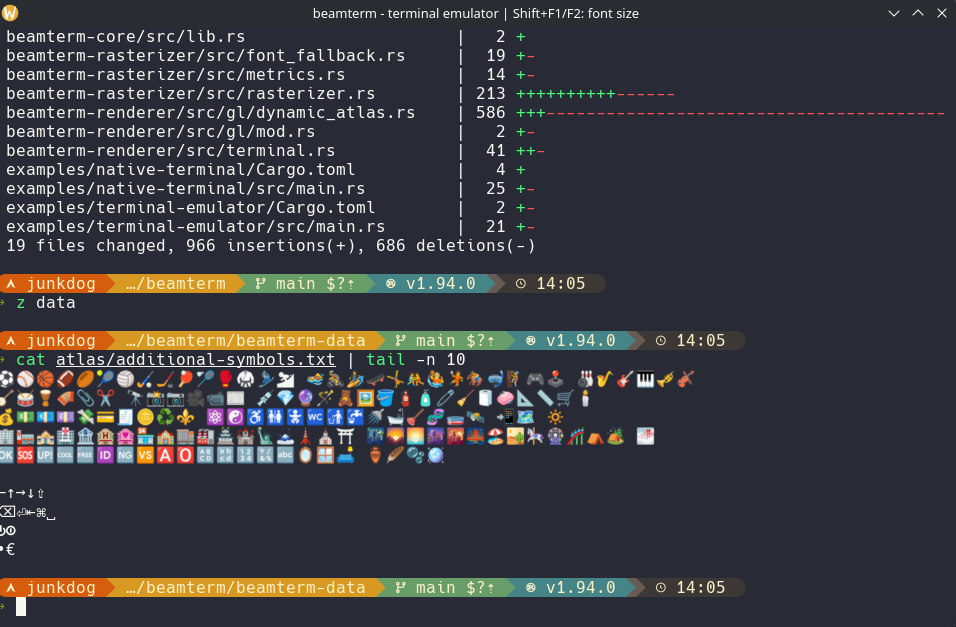

# beamterm terminal emulator

A GPU-accelerated terminal emulator built with [beamterm-core](../../beamterm-core/),
using the dynamic font atlas.

Use Shift+F1 / Shift+F2 to adjust the font size on the fly.



## Features

- **VT100/xterm-256color emulation** via [vt100](https://crates.io/crates/vt100)
- **Native PTY** via [portable-pty](https://crates.io/crates/portable-pty), spawns the user's default shell
- **Color support**: ANSI 16, 256-color cube, and 24-bit RGB
- **Text attributes**: bold, italic, underline, dim, inverse
- **Wide character support**: emoji and CJK characters
- **Application cursor mode**: compatible with TUI apps (e.g., vim, htop)
- **DSR (Device Status Report)**: cursor position queries for ratatui and similar frameworks

Terminal emulation is handled by `vt100` and `portable-pty`; beamterm provides
the GPU rendering layer.

## Running

```bash
cargo run -p terminal-emulator
```

## Benchmarks

### Test environment

| Component | Details                                          |
|-----------|--------------------------------------------------|
| CPU       | AMD Ryzen AI MAX+ PRO 395 w/ Radeon 8060S        |
| GPU       | AMD Radeon 8060S (Strix Halo, integrated)        |
| OS        | Arch Linux, kernel 6.17.9                        |
| Desktop   | KDE Plasma (Wayland)                             |
| Terminal  | 160x45                                           |

Lower is better for vtebench (ms), higher is better for kitten (MB/s).

### vtebench

| Test                          | beamterm    | alacritty    | kitty    | urxvt     | konsole  |
| ----------------------------- | ----------- | ------------ | -------- | --------- | -------- |
| cursor_motion                 | **4.34ms**  | 6.48ms       | 15.65ms  | 6.94ms    | 19.6ms   |
| dense_cells                   | **13.86ms** | 18.5ms       | 33.26ms  | 1469.88ms | 64.86ms  |
| light_cells                   | **3.09ms**  | 4.03ms       | 5.71ms   | 5.02ms    | 21.58ms  |
| medium_cells                  | **4.23ms**  | 5.13ms       | 10.17ms  | 5.21ms    | 63.02ms  |
| scrolling                     | 170.12ms    | **115.16ms** | 168.14ms | 120.7ms   | 151.42ms |
| scrolling_bottom_region       | 170.46ms    | **114.03ms** | 145.88ms | 119.74ms  | 151.97ms |
| scrolling_bottom_small_region | 171.86ms    | **120.12ms** | 144.68ms | 125.56ms  | 153.74ms |
| scrolling_fullscreen          | 6.97ms      | 5.23ms       | 14.25ms  | **4.6ms** | 16.03ms  |
| scrolling_top_region          | 171.2ms     | **120.49ms** | 146.28ms | 131.34ms  | 153.6ms  |
| scrolling_top_small_region    | 169.86ms    | **119.92ms** | 144.57ms | 132.88ms  | 153.08ms |
| sync_medium_cells             | **4.41ms**  | 5.93ms       | 18.79ms  | 5.47ms    | 66.15ms  |
| unicode                       | 201.12ms    | **4.03ms**   | 580.39ms | 15533ms   | 39.87ms  |

### kitten benchmark

| Test                     | beamterm       | alacritty      | kitty      | urxvt      | konsole   |
| ------------------------ | -------------- | -------------- | ---------- | ---------- | --------- |
| Only ASCII chars         | **193.5 MB/s** | 157.3 MB/s     | 123.3 MB/s | 158.2 MB/s | 55.5 MB/s |
| Unicode chars            | **227.6 MB/s** | 195.5 MB/s     | 130.5 MB/s | 99.4 MB/s  | 82.8 MB/s |
| CSI codes with few chars | **217.6 MB/s** | 90.7 MB/s      | 66.6 MB/s  | 188.0 MB/s | 46.3 MB/s |
| Long escape codes        | **560.2 MB/s** | 182.4 MB/s     | 332.5 MB/s | 92.4 MB/s  | 82.3 MB/s |
| Images                   | 380.8 MB/s     | **518.9 MB/s** | 316.9 MB/s | 200.9 MB/s | 37.4 MB/s |
